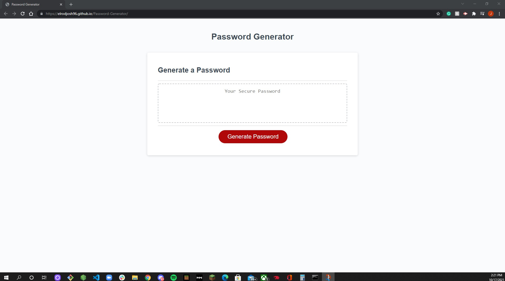

# Password-Generator

Link for deployed page: https://elrodjosh96.github.io/Password-Generator/

## Table of Contents

* [Description](#description)
* [Installation](#installation)
* [Contribution](#contribution)
* [Questions](#questions)

## Description
This password generator will prompt the user to specify the length of the password, and gives the options for using lowercase/uppercase letters, number or specials characters. The password length must be a minimum of 8 characters and no longer than 128 characters. This was a simply build using basic HTML and CSS components. The functionality was built using JavaScript. I hope you will find this app useful in creating a new randomized secure password!
## Installation
You will need to clone this repo onto your computer. From there you will simply open the index.html file in the default browser and be able to access this locally.
## Usage

## Contribution
None.
## Test 

## License

## Questions
Email: 
elrodjosh96@gmail.com
Github Username:
elrodjosh96

